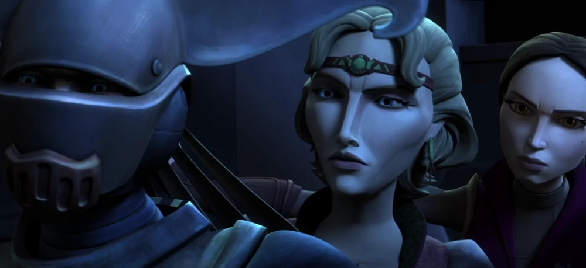

[back](./)

## Season 3

New threats emerge from the conflict, furtherdisrupting the tenuous balance of power. Inaddition to assassins, bounty hunters, monstersand more, Season Three pits the Jedi Knightsagainst Jabba the Hutt, Greedo and the deadlybrother of Sith apprentice Darth Maul! Mystery,intrigue and adventure await Padawan Ahsoka Tanoas she must prove her strength as a Jedi with thehelp of a familiar furry ally, Chewbacca.

Episodes

1. Clone Cadets —\
**"Brothers in arms are brothers for life."**
1. ARC Troopers —\
**"Fighting a war tests a soldier's skills, defending his home tests a soldier's heart."**
1. Supply Lines —\
**"Where there's a will, there's a way."**
1. Sphere of Influence —\
**"A child stolen is a hope lost."**
1. Corruption —\
**"The challenge of hope is to overcome corruption."**
1. The Academy —\
**"Those who enforce the law must obey the law."**
1. Assassin —\
**"The future has many paths – choose wisely."**
1. Evil Plans —\
**"A failure in planning is a plan for failure."**
1. Hunt for Ziro —\
**"Love comes in all shapes and sizes."**
1. Heroes on Both Sides —\
**"Fear is a great motivator."**
1. Pursuit of Peace —\
**"Truth can strike down the spectre of fear."**
1. Nightsisters —\
**"The swiftest path to destruction is through vengeance."**
1. Monster —\
**"Evil is not born, it is taught."**
1. Witches of the Mist —\
**"The path to evil may bring great power, but not loyalty."**
1. Overlords —\
**"Balance is found in the one who faces his guilt."**
1. Altar of Mortis —\
**"He who surrenders hope, surrenders life."**
1. Ghosts of Mortis —\
**"He who seeks to control fate shall never find peace."**
1. The Citadel —\
**"Adaptation is the key to survival."**
1. Counterattack —\
**"Anything that can go wrong will."**
1. Citadel Rescue —\
**"Without honor, victory is hollow."**
1. Padawan Lost —\
**"Without humility, courage is a dangerous game."**

[back](./)
