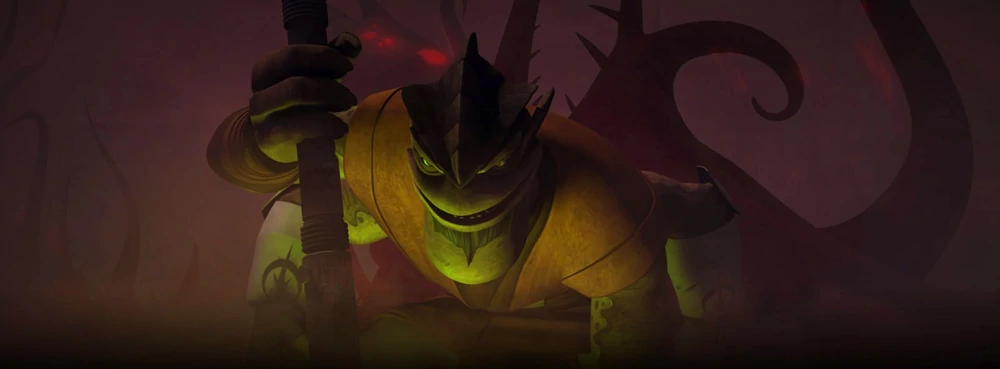

[back](./)

## Season 4

The valiant Jedi Knights and clone troopers defendexotic planets from enemy forces. They wage warunderwater, battle across a night-shrouded worldand take on the merciless Death Watch. Our heroesare tested like never before as Anakin is hauntedby the realities of his past, Ahsoka fights to freeher people, and an undercover Obi-Wan braves adeadly bounty hunter tournament. Season Fourculminates with the shocking return of a villain fromthe past: the ruthless Darth Maul, who will stop atnothing to achieve vengeance.

Episodes

1. Water War —\
**"When destiny calls, the chosen have no choice."**
1. Gungan Attack —\
**"Only through fire is a strong sword forged."**
1. Prisoners —\
**"Crowns are inherited, kingdoms are earned."**
1. Shadow Warrior —\
**"Who a person truly is cannot be seen with the eye."**
1. Mercy Mission —\
**"Understanding is honoring the truth beneath the surface."**
1. Nomad Droids —\
**"Who's the more foolish, the fool or the fool who follows him?"**
1. Darkness on Umbara —\
**"The first step towards loyalty is trust."**
1. The General —\
**"The path of ignorance is guided by fear."**
1. Plan of Dissent —\
**"The wise man leads, the strong man follows."**
1. Carnage of Krell —\
**"Our actions define our legacy."**
1. Kidnapped —\
**"Where we are going always reflects where we came from."**
1. Slaves of the Republic —\
**"Those who enslave others, inevitably become slaves themselves."**
1. Escape from Kadavo —\
**"Great hope can come from small sacrifices."**
1. A Friend in Need —\
**"Friendship shows us who we really are."**
1. Deception —\
**"All warfare is based on deception."**
1. Friends and Enemies —\
**"Keep your friends close, but keep your enemies closer."**
1. The Box —\
**"The strong survive, the noble overcome."**
1. Crisis on Naboo —\
**"Trust is the greatest of gifts, but it must be earned."**
1. Massacre —\
**"One must let go of the past to hold on to the future."**
1. Bounty —\
**"Who we are never changes, who we think we are does."**
1. Brothers —\
**"A fallen enemy may rise again, but the reconciled one is truly vanquished."**
1. Revenge —\
**"The enemy of my enemy is my friend."**

[back](./)
