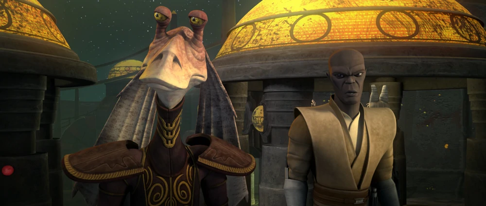

[back](./)

## Season 6

Against a backdrop of ever-shifting loyalties, uneasy alliances andancient hostilities, the conflict between the Republic and theSeparatists ramps up, setting the stage for Darth Sidious' ultimateact of treachery against the Jedi. In these uncertain times, someof the deepest mysteries of the light and dark sides of the Forceare revealed as an intrepid clone trooper uncovers a shockingconspiracy, Anakin Skywalker's closest relationship is tested toits limits, and Master Yoda makes a discovery that could foreverchange the balance of power in the galaxy.

Episodes

1. The Unknown —\
**"The truth about yourself is always the hardest to accept."**
1. Conspiracy —\
**"The wise benefit from a second opinion."**
1. Fugitive —\
**"When in doubt, go to the source."**
1. Orders —\
**"The popular belief isn't always the correct one."**
1. An Old Friend —\
**"To love, is to trust. To trust is to believe."**
1. The Rise of Clovis —\
**"Jealousy is the path to chaos."**
1. Crisis at the Heart —\
**"Deceit is the weapon of greed."**
1. The Disappeared Pt. 1 —\
**"Without darkness there cannot be light."**
1. The Disappeared Pt. 2 —\
**"Wisdom is born in fools as well as wise men."**
1. The Lost One —\
**"What is lost is often found."**
1. Voices —\
**"Madness can sometimes be the path to truth."**
1. Destiny —\
**"Death is just the beginning."**
1. Sacrifice —\
**"Facing all that you fear will free you from yourself."**

[back](./)
